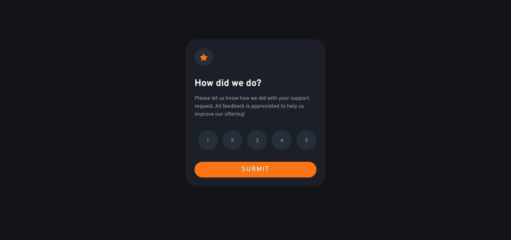

# Frontend Mentor - Interactive rating component solution

This is a solution to the [Interactive rating component challenge on Frontend Mentor](https://www.frontendmentor.io/challenges/interactive-rating-component-koxpeBUmI). Frontend Mentor challenges help you improve your coding skills by building realistic projects.

## Table of contents

- [Overview](#overview)
  - [The challenge](#the-challenge)
  - [Screenshot](#screenshot)
  - [Links](#links)
- [My process](#my-process)
  - [Built with](#built-with)
  - [What I learned](#what-i-learned)
  - [Useful resources](#useful-resources)
- [Author](#author)
- [Acknowledgments](#acknowledgments)

## Overview

### The challenge

Users should be able to:

- View the optimal layout for the app depending on their device's screen size
- See hover states for all interactive elements on the page
- Select and submit a number rating
- See the "Thank you" card state after submitting a rating

### Screenshot

- Desktop version.
  
  

- Mobile version.
  
  

### Links

- Solution URL: [Source code on Github](https://github.com/Abaljerind/interactive-rating)
- Live Site URL: [Interactive Rating](https://interactive-rating-git-main-abaljerind.vercel.app/)

## My process

### Built with

- Semantic HTML5 markup
- CSS custom properties
- [Bootstrap](https://getbootstrap.com/) - For styles
- Javascript DOM
- Javascript Event Listener

**Note: These are just examples. Delete this note and replace the list above with your own choices**

### What I learned

I just know that i can only use the pseudo-class :hover for many class like the code below, it should've look like that. Before the css code below look like that, i just give the :hover to the last class only, and i found it didn't go well, after i check again on google, i found out the :hover should've been given to all the class not just the last one, so yeah at least i learn and now i know. For the javascript code below, it was one of many idea how to show and hide the card section and the modal section, and i use this one cause it's more easy and less code.

```html
<h1>Some code I'm proud of</h1>
```

```css
.one:hover,
.two:hover,
.three:hover,
.four:hover,
.five:hover {
  background-color: hsl(25, 97%, 53%);
  color: white;
  cursor: pointer;
}
```

```js
btn.addEventListener("click", function () {
  card.style.display = "none";
});

btnClose.addEventListener("click", function () {
  card.style.display = "block";
});
```

### Useful resources

- [Bootstrap](https://getbootstrap.com/) - This helped me to do the styling more easy. I really liked this bootstrap and will use it going forward.
- [Vercel](https://vercel.com) - This is an amazing website which helped me to upload my website into the internet. I'd recommend it to anyone still learning to use this website.

## Author

- Website - [AbalJerind](https://interactive-rating-git-main-abaljerind.vercel.app/)
- Frontend Mentor - [@Abaljerind](https://www.frontendmentor.io/profile/Abaljerind)

## Acknowledgments

I want to thank me for believing in me, I want to thank me for doing all this hard work. I wanna thank me for having no days off. I wanna thank me for never quitting. I wanna thank me for being me at all times.
